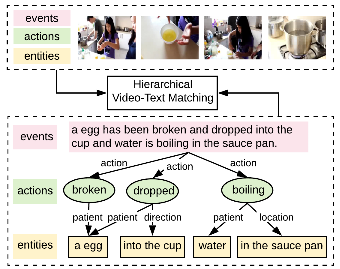

# Fine-grained Video-Text Retrieval with Hierarchical Graph Reasoning 

This repository contains PyTorch implementation of our paper [Fine-grained Video-Text Retrieval with Hierarchical Graph Reasoning (CVPR 2020)](https://arxiv.org/abs/2003.00392).



## Prerequisites
Python 3 and PyTorch 1.3.

```
# clone the repository
git clone git@github.com:cshizhe/hgr_v2t.git
cd hgr_v2t
export PYTHONPATH=$(pwd):${PYTHONPATH}
```

## Datasets
We provide annotations, pretrained features on MSRVTT, TGIF, VATEX and Youtube2Text video captioning datasets, which can be downloaded from [BaiduNetdisk](https://pan.baidu.com/s/1wpmVP8eCClw5lR5BtILVoQ) (code: 7hbe).

### Annotations

- groundtruth: annotation/RET directory

1) ref_captions.json: dict, {videoname: [sent]}
2) sent2rolegraph.augment.json: {sent: (graph_nodes, graph_edges)}

- vocabularies: annotation/RET directory
int2word.npy: [word]
word2int.json: {word: int}

- data splits: public_split directory
trn_names.npy, val_names.npy, tst_names.npy

### Features

For MSRVTT, TGIF and Youtube2Text datasets, we extract features with [Resnet152 pretrained on ImageNet](https://pytorch.org/docs/stable/torchvision/models.html).
For VATEX dataset, we use the [I3D features](http://vatex.org/main/download.html) released by VATEX challenge organizers.

- mean pooling features: ordered_feature/MP directory

format: np array, shape=(num_fts, dim_ft) corresponding to the order in data_split names

- frame-level features: ordered_feature/SA directory

format: hdf5 file, {name: ft}, ft.shape=(num_frames, dim_ft)

### Fine-grained Binary Selection Annotation
We construct the fine-grained binary selection dataset based on the testing set of Youtube2Text dataset. The annotations are in the Youtube2Text/annotation/binary_selection directory.

## Training & Inference
### Semantic Graph Construction
We provided constructed role graph annotations. If you want to generate role graphs for new datasets, please follow the following instructions.

1. semantic role labeling:
```
python misc/semantic_role_labeling.py ref_caption_file out_file --cuda_device 0
```

2. convert sentence into role graph:
```
cd misc
jupyter notebook
# open parse_sent_to_role_graph.ipynd
```

### Training and Evaluation
1) The baseline [VSE++ model](https://arxiv.org/abs/1707.05612):
```
cd t2vretrieval/driver

# setup config files
# you should modify data paths in configs/prepare_globalmatch_configs.py
python configs/prepare_globalmatch_cofig.py $datadir
resdir='' # copy the output string of the previous step

# training
python global_match.py $resdir/model.json $resdir/path.json --is_train --resume_file $resdir/../../word_embeds.glove42b.th

# inference
python global_match.py $resdir/model.json $resdir/path.json --eval_set tst
```

2) Our HGR model:
```
cd t2vretrieval/driver

# setup config files
# you should modify data paths in configs/prepare_mlmatch_configs.py
python configs/prepare_mlmatch_configs.py $datadir
resdir='' # copy the output string of the previous step

# training
python multilevel_match.py $resdir/model.json $resdir/path.json --load_video_first --is_train --resume_file $resdir/../../word_embeds.glove42b.th

# inference
python multilevel_match.py $resdir/model.json $resdir/path.json --load_video_first --eval_set tst
```

## Citations
If you use this code as part of any published research, we'd really appreciate it if you could cite the following paper:
```text
@article{chen2020fine,
  title={Fine-grained Video-Text Retrieval with Hierarchical Graph Reasoning},
  author={Chen, Shizhe and Zhao, Yida and Jin, Qin and Wu, Qi},
  journal={CVPR},
  year={2020}
}
```


## License

MIT License


